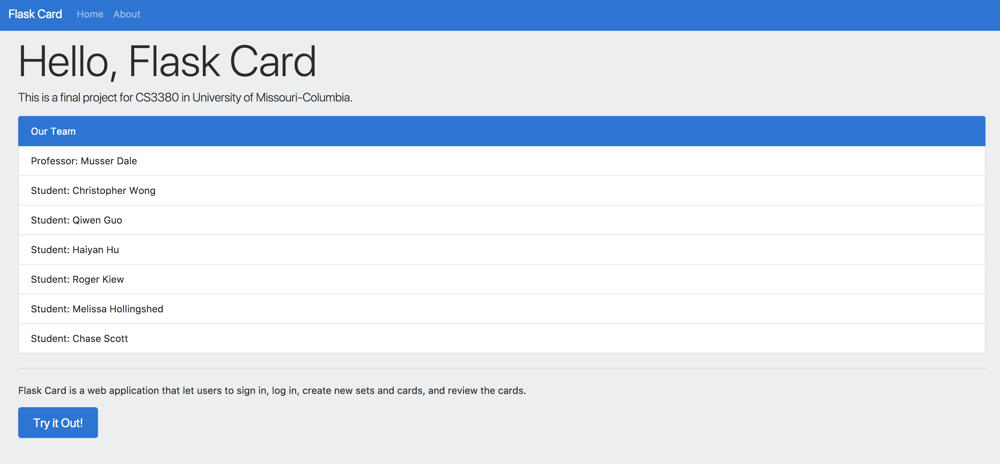

## List of Group Members

* Christopher Wong
* Qiwen Guo
* Haiyan Hu
* Roger Kiew
* Melissa Hollingshed
* Chase Scott

## Link to our program:
http://test.cwong.org/login

## Description 

The name of our application is FlaskCards. This is the perfect application for students or anyone interested in using virtual flash cards. Our application allows a specific user to sign up with their name, custom username, and custom password. The user can log in and will be redirected to the home page. The homepage is essentially an “add sets” page. From this page you can edit the set, delete, or add another set. On the set container you can create a new set name and category. The user will then have to option to go inside the set. 

The user is then redirected to the card preview page. In this page the user can create a new card with a front and back. The card will appear and the user can manually flip the card as much as he/she desires.  The user can go to the about page and learn about the team behind this awesome world changing application. After they are done creating their FlaskCards they can logout and continue another day. This page is responsive and can be used not only on the computer but also on mobile devices. Enjoy!


## Database Schema

| Users    |              |
| -----    | ---          |
| id       | integer      |
| username | varchar(15)  |
| fullname | varchar(255) |
| password | char(94)     |

| Sets       |              |
| ----       | ---          |
| id         | integer      |
| name       | varchar(255) |
| categoryid | integer      |

| Cards      |               |
| -----      | ---           |
| id         | integer       |
| setid      | integer       |
| front      | varchar(1023) |

| Category |              |
| -------- | ---          |
| id       | integer      |
| userid   | integer      |
| name     | varchar(255) |

## Entity Relationship Diagram

![ERD]
(ERD.png)


## Explanation of CRUD

Create: 
	When the user click “Add Sets!” on the left the homepage, a window will pop up to ask the user type title and category for the new set. After clicked “Add” button, the program will insert data into Sets table based on the input.
```
	s = 'INSERT INTO Sets (name, categoryid, userid) VALUES (%s,%s,%s)'
```


In each sets, the user can click the “Add Card” button, a window will pop up to ask the user type the title of the card and the description of the card(referred as card front and card back). AFter clicked “add” button, the program will insert data into Cards table based on the input.
SQL statement used:

```
	statement = 'INSERT INTO Cards (setid, front, back) VALUES (%s, %s, %s)'
```

Read: 
When the user signed in, the program will read the data from the Sets table based on the user’s account.
```
	statement = 'SELECT * FROM Users WHERE username = %s'
```

After the user clicked ”Go to Set” button, the program will read the data from the Sets table based on the selected set.
```
	 statement = ('SELECT s.id, s.name, c.name '
                 'FROM Sets s INNER JOIN Category c ON s.categoryid = c.id'
                 'WHERE s.userid = %s ')
```

Update: 
In each set, when the user click edit, a window will pop up and the user needs to type a new title name and a new category. The program will update the names in the database based on the input.
```
	s = 'UPDATE Sets SET name = %s, categoryid = %s WHERE id = %s;'
```

Delete: 
Same as Update but if the user click delete instead, the program will delete the current set from the database.
```
    # Delete cards in set
    statement = 'DELETE FROM Cards WHERE setid = %s'
    
    # Delete set
    statement = 'DELETE FROM Sets WHERE id = %s'
```


## Link to Video Demostration 
[](https://www.youtube.com/watch?v=E_DU3xXYrSY&feature=youtu.be "Click to watch")


